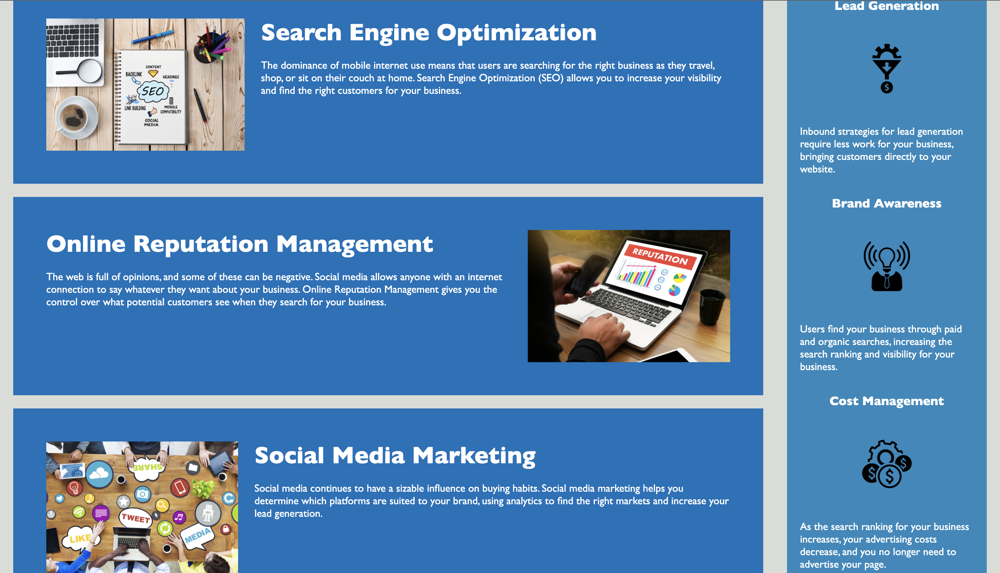

# Horiseon | Refactored Landing Page

Horiseon offers innovative online reputation management utilizing a wide array of strategies to ensure businesses maximize their online presence. Social media and the internet in general provide a highly important and newly emerging facet of engagement for prospective clientele. Within this repository acessible <alt> attributes have been added that adequetely describe all images shown within the Horeiseon landing page. Said <alt> altributes provide crucial aid to those who may have disabilities or if connectivity issues arise where WI-FI is limited and images do not load to the viewer. CSS styles have been further consolidated in accordance with DRY principles. Various comments that allow for easier interpretation for developers working with the included HTML and CSS documents. Descriptive and accurate title added. "Search Engine Optimization" link at top of page is now operation and navigates to the section of the same name.

Horiseon Initial Landing Page View:

Horiseon Services and Benefits Section:

Link to live URL: https://robbiemurphy7.github.io/Horiseon_Home/